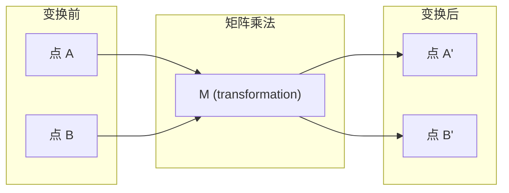
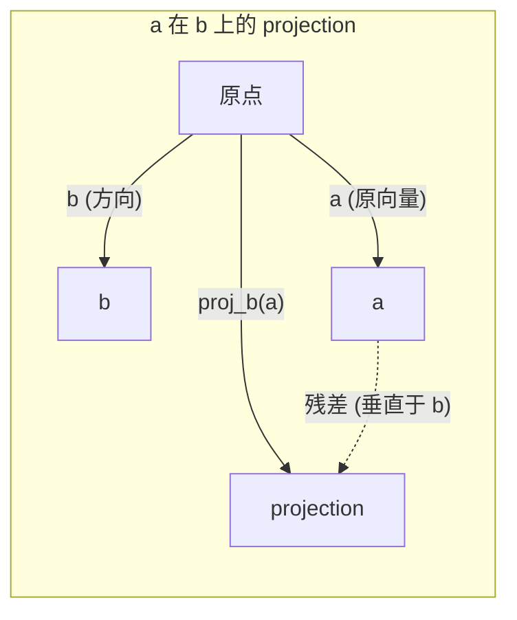

# 线性代数直觉

> 所有 AI 模型不过是穿了件花哨外衣的 matrix 数学。

**类型：** 学习
**语言：** Python, Julia
**前置要求：** Phase 0
**时间：** ~60 分钟

## 术语对照

- vector，向量
- matrix，矩阵
- dot product，点积
- projection，投影
- basis，基
- magnitude，模长
- embedding，嵌入
- attention score，注意力分数
- LoRA，低秩适应
- rank，秩
- Gram-Schmidt，格拉姆-施密特正交化
## 关键术语

| 术语 | 人们怎么说 | 实际含义 |
|------|-----------|---------|
| Vector | "一个箭头" | 一个代表 n 维空间中某点或某方向的数字列表 |
| Matrix | "一张数字表" | 一个将 vector 从一个空间映射到另一个空间的 transformation |
| Dot product | "乘起来加总" | 衡量两个 vector 方向对齐程度的指标——相似搜索的核心 |
| Embedding | "某种 AI 魔法" | 一个代表某物（词、图片、用户）含义的 vector |
| Linear independence | "它们不重叠" | 集合中没有 vector 可以由其他 vector 组合出来 |
| Rank | "有多少维度" | 一个 matrix 中线性独立列（或行）的数量 |
| Projection | "影子" | 一个 vector 在另一个 vector 方向上的分量 |
| Basis | "坐标轴" | 一组最小的、独立的、能张成整个空间的 vector |
| 正交归一 | "互相垂直的单位 vector" | 互相垂直且每个长度为 1 的 vector |

## 学习目标

- 用 Python 从零实现 vector 和 matrix 运算（加法、dot product、矩阵乘法）
- 用几何直觉解释 dot product、projection 和 Gram-Schmidt 过程的含义
- 使用行约简判断一组 vector 的线性独立性、rank 和 basis
- 将线性代数概念与 AI 应用联系起来：embedding、attention score 和 LoRA

## 问题

随便翻开一篇机器学习论文。第一页就会出现 vector、matrix、dot product 和 transformation。没有线性代数直觉，这些都只是符号。有了直觉，你就能看出神经网络实际在做什么——在空间中移动点。

你不需要成为数学家。你需要的是看到这些运算在几何上的含义，然后亲手编码实现。

## 概念

### Vector 是点（也是方向）

一个 vector 就是一串数字。但这些数字有意义——它们是空间中的坐标。

**二维 vector [3, 2]：**

| x | y | 含义 |
|---|---|-----|
| 3 | 2 | vector 从原点 (0,0) 指向平面上的 (3, 2) |

这个 vector 的 magnitude 为 $\sqrt{3^2 + 2^2} = \sqrt{13}$，方向是右上。

在 AI 中，vector 代表一切：
- 一个词 → 一个 768 个数字的 vector（它在 embedding 空间中的"含义"）
- 一张图片 → 一个数百万像素值的 vector
- 一个用户 → 一个偏好 vector

### Matrix 是 transformation

一个 matrix 把一个 vector 变成另一个 vector。它可以是旋转、缩放、拉伸或投影。



在 AI 中，matrix 就是模型本身：
- 神经网络的 weights → 把输入变换为输出的 matrix
- Attention score → 决定关注什么的 matrix
- Embedding → 把词映射到 vector 的 matrix

### Dot Product 衡量相似度

两个 vector 的 dot product 告诉你它们有多相似。

```
a · b = a₁×b₁ + a₂×b₂ + ... + aₙ×bₙ

同向：    a · b > 0  （相似）
垂直：    a · b = 0  （无关）
反向：    a · b < 0  （不相似）
```

搜索引擎、推荐系统和 RAG 正是这样工作的：找 dot product 最高的 vector。

### 线性独立

如果一组 vector 中没有哪个可以由其他 vector 组合出来，它们就是线性独立的。如果 v1, v2, v3 独立，它们张成一个 3D 空间。如果其中一个可以由其他组合出来，它们只张成一个平面。

为什么对 AI 很重要：你的特征 matrix 应该有线性独立的列。如果两个特征完全相关（线性依赖），模型无法区分它们各自的影响。这会导致回归中的多重共线性——weight matrix 变得不稳定，微小的输入变化产生剧烈的输出波动。

**具体例子：**

```
v1 = [1, 0, 0]
v2 = [0, 1, 0]
v3 = [2, 1, 0]   # v3 = 2*v1 + v2
```

v1 和 v2 是独立的——它们互不为对方的 scalar 倍数或组合。但 v3 = 2*v1 + v2，所以 {v1, v2, v3} 是一组依赖集。这三个 vector 全都在 xy 平面上。无论你怎么组合它们，都无法到达 [0, 0, 1]。你有三个 vector，却只有两个维度的自由度。

在数据集中：如果 feature_3 = 2*feature_1 + feature_2，加入 feature_3 不会给模型增加任何新信息。更糟的是，它让正规方程奇异——weights 没有唯一解。

### Basis 与 Rank

一个 basis 是一组最小的、线性独立的 vector，它们张成整个空间。basis vector 的数量就是空间的维度。

3D 空间的标准 basis 是 {[1,0,0], [0,1,0], [0,0,1]}。但 3D 空间中任何三个独立 vector 都可以构成一个有效的 basis。basis 的选择本质上就是坐标系的选择。

Matrix 的 rank = 线性独立列的数量 = 线性独立行的数量。如果 rank < min(行数, 列数)，这个 matrix 是 rank-deficient。这意味着：
- 系统有无穷多解（或没有解）
- 在 transformation 中丢失了信息
- Matrix 不可逆

| 情况 | Rank | 对 ML 意味着什么 |
|------|------|-----------------|
| 满秩 (rank = min(m, n)) | 最大可能 | 唯一的最小二乘解存在。模型条件良好。 |
| 秩不足 (rank < min(m, n)) | 低于最大 | 特征冗余。无穷多个 weight 解。需要正则化。 |
| Rank 1 | 1 | 每一列都是一个 vector 的缩放。所有数据都在一条线上。 |
| 近似秩不足（奇异值很小） | 数值上低 | Matrix 是病态的。微小的输入噪声导致巨大的输出变化。使用 SVD 截断或岭回归。 |

### Projection

将 vector **a** 投影到 vector **b** 上，得到 a 在 b 方向上的分量：

```
proj_b(a) = (a dot b / b dot b) * b
```

残差 (a - proj_b(a)) 垂直于 b。这种正交分解是最小二乘拟合的基础。

Projection 在 ML 中无处不在：
- 线性回归把观测值到列空间的距离最小化——解本身就是一个 projection
- PCA 把数据投影到方差最大的方向上
- Transformer 中的 attention 计算 query 在 key 上的 projection



**例子：** a = [3, 4], b = [1, 0]

proj_b(a) = (3*1 + 4*0) / (1*1 + 0*0) * [1, 0] = 3 * [1, 0] = [3, 0]

Projection 丢弃了 y 分量。这是最简单的降维形式——丢掉你不关心的方向。

### Gram-Schmidt 过程

将任意一组独立 vector 转化为正交归一的 basis。正交归一意味着每个 vector 长度为 1，且每对 vector 互相垂直。

算法：
1. 取第一个 vector，归一化
2. 取第二个 vector，减去它在第一个上的 projection，归一化
3. 取第三个 vector，减去它在所有前面 vector 上的 projection，归一化
4. 对剩余 vector 重复

```
输入：v1, v2, v3, ... (线性独立)

u1 = v1 / |v1|

w2 = v2 - (v2 dot u1) * u1
u2 = w2 / |w2|

w3 = v3 - (v3 dot u1) * u1 - (v3 dot u2) * u2
u3 = w3 / |w3|

输出：u1, u2, u3, ... (正交归一 basis)
```

QR 分解内部就是这样工作的。Q 是正交归一 basis，R 保存了 projection 系数。QR 分解用于：
- 求解线性系统（比高斯消元更数值稳定）
- 计算 eigenvalue（QR 算法）
- 最小二乘回归（标准的数值方法）

## 动手实现

### 第 1 步：从零实现 Vector（Python）

```python
class Vector:
    def __init__(self, components):
        self.components = list(components)
        self.dim = len(self.components)

    def __add__(self, other):
        return Vector([a + b for a, b in zip(self.components, other.components)])

    def __sub__(self, other):
        return Vector([a - b for a, b in zip(self.components, other.components)])

    def dot(self, other):
        return sum(a * b for a, b in zip(self.components, other.components))

    def magnitude(self):
        return sum(x**2 for x in self.components) ** 0.5

    def normalize(self):
        mag = self.magnitude()
        return Vector([x / mag for x in self.components])

    def cosine_similarity(self, other):
        return self.dot(other) / (self.magnitude() * other.magnitude())

    def __repr__(self):
        return f"Vector({self.components})"


a = Vector([1, 2, 3])
b = Vector([4, 5, 6])

print(f"a + b = {a + b}")
print(f"a · b = {a.dot(b)}")
print(f"|a| = {a.magnitude():.4f}")
print(f"cosine similarity = {a.cosine_similarity(b):.4f}")
```

### 第 2 步：从零实现 Matrix（Python）

```python
class Matrix:
    def __init__(self, rows):
        self.rows = [list(row) for row in rows]
        self.shape = (len(self.rows), len(self.rows[0]))

    def __matmul__(self, other):
        if isinstance(other, Vector):
            return Vector([
                sum(self.rows[i][j] * other.components[j] for j in range(self.shape[1]))
                for i in range(self.shape[0])
            ])
        rows = []
        for i in range(self.shape[0]):
            row = []
            for j in range(other.shape[1]):
                row.append(sum(
                    self.rows[i][k] * other.rows[k][j]
                    for k in range(self.shape[1])
                ))
            rows.append(row)
        return Matrix(rows)

    def transpose(self):
        return Matrix([
            [self.rows[j][i] for j in range(self.shape[0])]
            for i in range(self.shape[1])
        ])

    def __repr__(self):
        return f"Matrix({self.rows})"


rotation_90 = Matrix([[0, -1], [1, 0]])
point = Vector([3, 1])

rotated = rotation_90 @ point
print(f"原始点：{point}")
print(f"旋转 90°：{rotated}")
```

### 第 3 步：这对 AI 意味着什么

```python
import random

random.seed(42)
weights = Matrix([[random.gauss(0, 0.1) for _ in range(3)] for _ in range(2)])
input_vector = Vector([1.0, 0.5, -0.3])

output = weights @ input_vector
print(f"输入 (3D)：{input_vector}")
print(f"输出 (2D)：{output}")
print("这就是一个神经网络层在做的事情——矩阵乘法。")
```

### 第 4 步：Julia 版本

```julia
a = [1.0, 2.0, 3.0]
b = [4.0, 5.0, 6.0]

println("a + b = ", a + b)
println("a · b = ", a ⋅ b)       # Julia 支持 unicode 运算符
println("|a| = ", √(a ⋅ a))
println("cosine = ", (a ⋅ b) / (√(a ⋅ a) * √(b ⋅ b)))

# Matrix-vector 乘法
W = [0.1 -0.2 0.3; 0.4 0.5 -0.1]
x = [1.0, 0.5, -0.3]
println("Wx = ", W * x)
println("这是一个神经网络层。")
```

### 第 5 步：从零实现线性独立判断和 projection（Python）

```python
def is_linearly_independent(vectors):
    n = len(vectors)
    dim = len(vectors[0].components)
    mat = Matrix([v.components[:] for v in vectors])
    rows = [row[:] for row in mat.rows]
    rank = 0
    for col in range(dim):
        pivot = None
        for row in range(rank, len(rows)):
            if abs(rows[row][col]) > 1e-10:
                pivot = row
                break
        if pivot is None:
            continue
        rows[rank], rows[pivot] = rows[pivot], rows[rank]
        scale = rows[rank][col]
        rows[rank] = [x / scale for x in rows[rank]]
        for row in range(len(rows)):
            if row != rank and abs(rows[row][col]) > 1e-10:
                factor = rows[row][col]
                rows[row] = [rows[row][j] - factor * rows[rank][j] for j in range(dim)]
        rank += 1
    return rank == n


def project(a, b):
    scalar = a.dot(b) / b.dot(b)
    return Vector([scalar * x for x in b.components])


def gram_schmidt(vectors):
    orthonormal = []
    for v in vectors:
        w = v
        for u in orthonormal:
            proj = project(w, u)
            w = w - proj
        if w.magnitude() < 1e-10:
            continue
        orthonormal.append(w.normalize())
    return orthonormal


v1 = Vector([1, 0, 0])
v2 = Vector([1, 1, 0])
v3 = Vector([1, 1, 1])
basis = gram_schmidt([v1, v2, v3])
for i, u in enumerate(basis):
    print(f"u{i+1} = {u}")
    print(f"  |u{i+1}| = {u.magnitude():.6f}")

print(f"u1 · u2 = {basis[0].dot(basis[1]):.6f}")
print(f"u1 · u3 = {basis[0].dot(basis[2]):.6f}")
print(f"u2 · u3 = {basis[1].dot(basis[2]):.6f}")
```

## 实际使用

现在用 NumPy 做同样的事——你在实践中真正会用到的工具：

```python
import numpy as np

a = np.array([1, 2, 3], dtype=float)
b = np.array([4, 5, 6], dtype=float)

print(f"a + b = {a + b}")
print(f"a · b = {np.dot(a, b)}")
print(f"|a| = {np.linalg.norm(a):.4f}") # 求模长
print(f"cosine = {np.dot(a, b) / (np.linalg.norm(a) * np.linalg.norm(b)):.4f}")

W = np.random.randn(2, 3) * 0.1
x = np.array([1.0, 0.5, -0.3])
print(f"Wx = {W @ x}")
```

### NumPy 下的 Rank、Projection 和 QR

```python
import numpy as np

A = np.array([[1, 2], [2, 4]])
print(f"Rank: {np.linalg.matrix_rank(A)}")

a = np.array([3, 4])
b = np.array([1, 0])
proj = (np.dot(a, b) / np.dot(b, b)) * b
print(f"{a} 在 {b} 上的 projection：{proj}")

Q, R = np.linalg.qr(np.random.randn(3, 3))
print(f"Q 是正交的：{np.allclose(Q @ Q.T, np.eye(3))}")
print(f"R 是上三角的：{np.allclose(R, np.triu(R))}")
```

### PyTorch——Tensor 就是带自动微分的 Vector

```python
import torch

x = torch.randn(3, requires_grad=True)
y = torch.tensor([1.0, 0.0, 0.0])

similarity = torch.dot(x, y)
similarity.backward()

print(f"x = {x.data}")
print(f"y = {y.data}")
print(f"dot product = {similarity.item():.4f}")
print(f"d(dot)/dx = {x.grad}")
```

Dot product 对 x 的 gradient 恰好是 y。PyTorch 自动计算了这一点。神经网络中的每一个操作都由这类运算——矩阵乘法、dot product、projection——组成，而自动微分追踪了所有操作中的 gradient。

你刚刚从零实现了 NumPy 一行就能完成的事情。现在你知道底层在发生什么了。

## 产出

本节课产出：
- `outputs/prompt-linear-algebra-tutor.md`——一个让 AI 助手通过几何直觉教授线性代数的 prompt

## 关联

本文的每个概念都与现代 AI 的具体部分相连：

| 概念 | 出现的地方 |
|------|-----------|
| Dot product | Transformer 中的 attention score，RAG 中的 cosine similarity |
| 矩阵乘法 | 每一个神经网络层，每一次线性变换 |
| 线性独立 | 特征选择，避免多重共线性 |
| Rank | 判断系统是否可解，LoRA（low-rank adaptation） |
| Projection | 线性回归（projection 到列空间），PCA |
| Gram-Schmidt / QR | 数值求解器，eigenvalue 计算 |
| 正交归一 basis | 稳定的数值计算，白化变换 |

LoRA 值得特别提及。它通过把 weight 更新分解为低 rank matrix 来微调大语言模型。与更新一个 4096×4096 的 weight matrix（16M 参数）不同，LoRA 更新两个 4096×16 和 16×4096 的 matrix（131K 参数）。Rank-16 的约束意味着 LoRA 假设 weight 更新存在于全 4096 维空间的一个 16 维子空间中。这就是线性代数在做实实在在的工作。

## 练习

1. 实现 `Vector.angle_between(other)`，返回两个 vector 之间的角度（以度为单位）
2. 创建一个 2D 缩放 matrix，使 x 坐标翻倍、y 坐标变为三倍，然后应用到 vector [1, 1] 上
3. 给定 5 个随机的类似词向量的 vector（维度为 50），用 cosine similarity 找出最相似的两个
4. 验证 Gram-Schmidt 的输出确实是正交归一的：检查每对 dot product 是否为 0，每个 vector 的 magnitude 是否为 1
5. 创建一个 rank 为 2 的 3×3 matrix。用 `rank()` 方法验证。然后解释这些列张成了什么几何对象
6. 把 vector [1, 2, 3] 投影到 [1, 1, 1] 上。结果在几何上代表什么？
