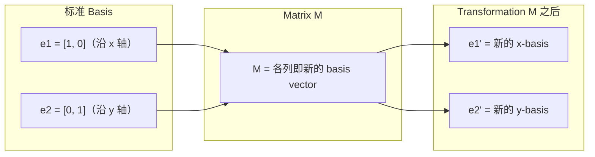
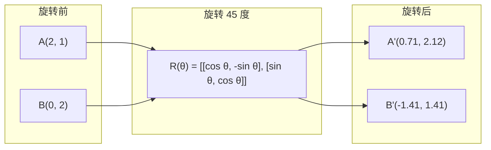
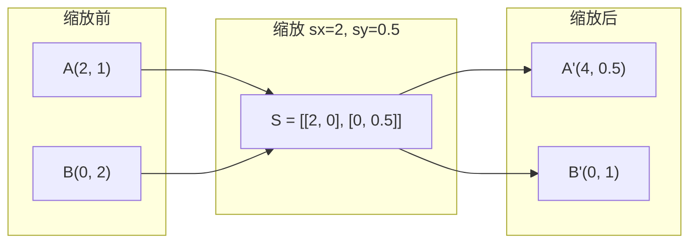
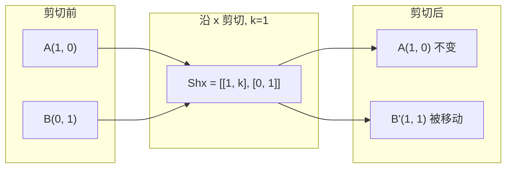
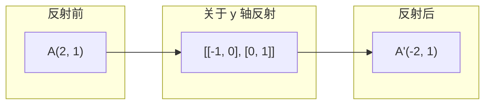
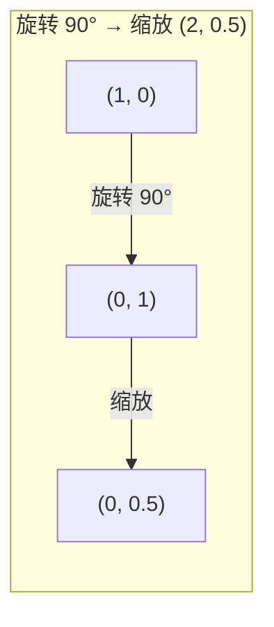
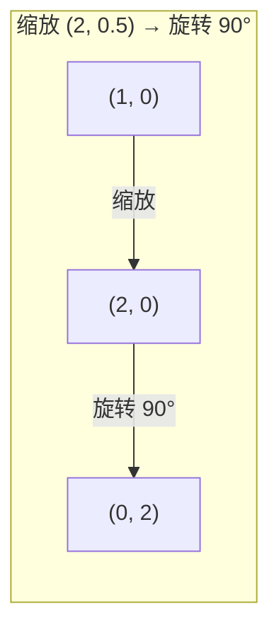

# Matrix Transformation

> Matrix 是一台重塑空间的机器。理解它对每个点做了什么，你就理解了整个 transformation。

**类型：** 动手实现
**语言：** Python, Julia
**前置要求：** Phase 1, Lesson 01-02（线性代数直觉、Vector 与 Matrix 运算）
**时间：** ~75 分钟

## 术语对照

- eigenvalue，特征值
- eigenvector，特征向量
- transformation，变换
- rotation，旋转
- scaling，缩放
- shearing，剪切
- reflection，反射
- covariance matrix，协方差矩阵
- determinant，行列式
- PCA，主成分分析
- spectral clustering，谱聚类
## 关键术语

| 术语 | 人们怎么说 | 实际含义 |
|------|-----------|---------|
| 旋转 matrix | "转动东西" | 一个正交 matrix，将点沿圆弧移动，同时保持距离和角度。determinant 始终为 1。 |
| 缩放 matrix | "把东西变大" | 一个对角 matrix，沿每条轴独立拉伸或压缩。determinant 是各缩放因子的乘积。 |
| 剪切 matrix | "倾斜东西" | 一个将一个坐标按比例偏移到另一个坐标的 matrix，将矩形变成平行四边形。determinant 为 1。 |
| 反射 | "镜像东西" | 一个将空间关于某条轴或某个平面翻转的 matrix。determinant 为 -1。 |
| 组合 | "做两件事" | 将 transformation matrix 相乘以串联操作。顺序很重要：B @ A 表示先应用 A，再应用 B。 |
| Eigenvector | "特殊方向" | 一个 matrix 只缩放、从不旋转的方向。Transformation 的指纹。 |
| Eigenvalue | "拉伸了多少倍" | Matrix 对其 eigenvector 进行缩放的标量因子。可以为负（翻转）或复数（旋转）。 |
| 特征分解 | "拆开 matrix" | 将 matrix 写为 V @ D @ V^(-1)，将其分解为基本缩放方向和大小。 |
| Determinant | "从 matrix 得出的一个数" | Transformation 缩放面积（2D）或体积（3D）的因子。零意味着 transformation 不可逆。 |
| 特征方程 | "eigenvalue 的来源" | det(A - lambda * I) = 0。其根即为 eigenvalue 的多项式。 |

## 扩展阅读

- [3Blue1Brown：线性 Transformations](https://www.3blue1brown.com/lessons/linear-transformations) —— matrix 如何重塑空间的视觉直觉
- [3Blue1Brown：Eigenvector 与 Eigenvalue](https://www.3blue1brown.com/lessons/eigenvalues) —— eigenvector 几何含义的最佳视觉解释
- [MIT 18.06 Lecture 21：Eigenvalue 与 Eigenvector](https://ocw.mit.edu/courses/18-06-linear-algebra-spring-2010/) —— Gilbert Strang 的经典讲授

## 学习目标

- 构造旋转、缩放、剪切和反射 matrix 并将其应用于 2D 和 3D 点
- 通过矩阵乘法组合多个 transformation，并验证顺序的重要性
- 从特征方程计算 2×2 matrix 的 eigenvalue 和 eigenvector
- 解释为什么 eigenvalue 决定了 PCA 方向、RNN 稳定性和谱聚类行为

## 问题

你读到 PCA 时看到"求 covariance matrix 的 eigenvector"。你读到模型稳定性时看到"检查是否所有 eigenvalue 的 magnitude 小于 1"。你读到数据增强时看到"应用一个随机旋转"。在理解 matrix 在几何上对空间做了什么之前，这些都不 make sense。

Matrix 不只是数字表格。它们是空间机器。一个旋转 matrix 转动点。一个缩放 matrix 拉伸点。一个剪切 matrix 倾斜点。神经网络对数据施加的每一个 transformation 都是这些操作之一或它们的组合。这节课让这些操作变得具体。

## 概念

### Transformation 即 matrix

每个 2D 线性 transformation 都可以写成一个 2×2 matrix。这个 matrix 精确告诉了你 basis vector [1, 0] 和 [0, 1] 会落在哪里。其他一切都随之确定。



### 旋转

2D 旋转（角度 theta）保持距离和角度不变。它将每个点沿圆弧移动。



在 3D 中，你绕轴旋转。每条轴有自己的旋转 matrix：

```
Rz(theta) = | cos  -sin  0 |     绕 z 轴旋转
            | sin   cos  0 |     (x-y 平面旋转，z 保持不变)
            |  0     0   1 |

Rx(theta) = | 1   0     0    |   绕 x 轴旋转
            | 0  cos  -sin   |   (y-z 平面旋转，x 保持不变)
            | 0  sin   cos   |

Ry(theta) = |  cos  0  sin |     绕 y 轴旋转
            |   0   1   0  |     (x-z 平面旋转，y 保持不变)
            | -sin  0  cos |
```

### 缩放

缩放沿每条轴独立地拉伸或压缩。



### 剪切

剪切倾斜一条轴同时保持另一条固定。它将矩形变成平行四边形。



剪切 matrix：
- `Shx = [[1, k], [0, 1]]` 将 x 偏移 k×y
- `Shy = [[1, 0], [k, 1]]` 将 y 偏移 k×x

### 反射

反射将点关于某条轴或某条线镜像翻转。



反射 matrix：
- 关于 y 轴反射：`[[-1, 0], [0, 1]]`
- 关于 x 轴反射：`[[1, 0], [0, -1]]`

### 组合：串联 transformation

先应用 transformation A 再应用 B，等同于将它们的 matrix 相乘：`result = B @ A @ point`。顺序很重要。先旋转再缩放与先缩放再旋转的结果不同。



组合结果：`S @ R = [[0, -2], [0.5, 0]]`



组合结果：`R @ S = [[0, -0.5], [2, 0]]`

不同的结果。矩阵乘法不满足交换律。

### Eigenvalue 与 Eigenvector

大多数 vector 在被 matrix 作用时会改变方向。Eigenvector 是特殊的：matrix 只缩放它们，从不旋转它们。缩放因子就是 eigenvalue。

```
A @ v = lambda × v

v 是 eigenvector（存留下来的方向）
lambda 是 eigenvalue（拉伸多少倍）

例子：A = | 2  1 |
          | 1  2 |

Eigenvector [1, 1]，eigenvalue 3：
  A @ [1,1] = [3, 3] = 3 × [1, 1]     （方向不变，缩放 3 倍）

Eigenvector [1, -1]，eigenvalue 1：
  A @ [1,-1] = [1, -1] = 1 × [1, -1]  （方向不变，保持不变）
```

这个 matrix 沿 [1, 1] 方向将空间拉伸 3 倍，同时保持 [1, -1] 不变。其他所有方向都是这两者的混合。

### 特征分解

如果一个 matrix 有 n 个线性独立的 eigenvector，它可以被分解：

```
A = V @ D @ V^(-1)

V = 各列为 eigenvector 的 matrix
D = eigenvalue 构成的对角 matrix
V^(-1) = V 的逆

含义是：旋转到 eigenvector 坐标系，沿每条轴缩放，再旋转回来。
```

### 为什么 eigenvalue 重要

**PCA。** Covariance matrix 的 eigenvector 就是主成分。Eigenvalue 告诉你每个成分捕获了多少方差。按 eigenvalue 排序，保留前 k 个，你就得到了降维。

**稳定性。** 在循环网络和动态系统中，magnitude > 1 的 eigenvalue 导致输出爆炸。magnitude < 1 导致输出消失。这就是 gradient vanishing / exploding 问题的一句话表述。

**谱方法。** 图神经网络使用邻接 matrix 的 eigenvalue。谱聚类使用 Laplacian matrix 的 eigenvalue。Eigenvector 揭示了图的结构。

### Determinant 作为体积缩放因子

Transformation matrix 的 determinant 告诉你它将面积（2D）或体积（3D）缩放了多少。

```
det = 1：面积保持不变（旋转）
det = 2：面积翻倍
det = 0：空间被压扁到更低维度（奇异）
det = -1：面积不变但方向翻转（反射）

|det(旋转)| = 1        （总是如此）
|det(缩放 sx, sy)| = sx × sy
|det(剪切)| = 1         （面积保持不变）
|det(反射)| = -1       （方向翻转）
```

## 动手实现

### 第 1 步：从零实现 transformation matrix（Python）

```python
import math

def rotation_2d(theta):
    c, s = math.cos(theta), math.sin(theta)
    return [[c, -s], [s, c]]

def scaling_2d(sx, sy):
    return [[sx, 0], [0, sy]]

def shearing_2d(kx, ky):
    return [[1, kx], [ky, 1]]

def reflection_x():
    return [[1, 0], [0, -1]]

def reflection_y():
    return [[-1, 0], [0, 1]]

def mat_vec_mul(matrix, vector):
    return [
        sum(matrix[i][j] * vector[j] for j in range(len(vector)))
        for i in range(len(matrix))
    ]

def mat_mul(a, b):
    rows_a, cols_b = len(a), len(b[0])
    cols_a = len(a[0])
    return [
        [sum(a[i][k] * b[k][j] for k in range(cols_a)) for j in range(cols_b)]
        for i in range(rows_a)
    ]

point = [1.0, 0.0]
angle = math.pi / 4

rotated = mat_vec_mul(rotation_2d(angle), point)
print(f"将 (1,0) 旋转 45°：({rotated[0]:.4f}, {rotated[1]:.4f})")

scaled = mat_vec_mul(scaling_2d(2, 3), [1.0, 1.0])
print(f"将 (1,1) 缩放 (2,3)：({scaled[0]:.1f}, {scaled[1]:.1f})")

sheared = mat_vec_mul(shearing_2d(1, 0), [1.0, 1.0])
print(f"将 (1,1) 剪切 kx=1：({sheared[0]:.1f}, {sheared[1]:.1f})")

reflected = mat_vec_mul(reflection_y(), [2.0, 1.0])
print(f"将 (2,1) 关于 y 反射：({reflected[0]:.1f}, {reflected[1]:.1f})")
```

### 第 2 步：Transformation 的组合

```python
R = rotation_2d(math.pi / 2)
S = scaling_2d(2, 0.5)

rotate_then_scale = mat_mul(S, R)
scale_then_rotate = mat_mul(R, S)

point = [1.0, 0.0]
result1 = mat_vec_mul(rotate_then_scale, point)
result2 = mat_vec_mul(scale_then_rotate, point)

print(f"先旋转 90° 再缩放：({result1[0]:.2f}, {result1[1]:.2f})")
print(f"先缩放再旋转 90°：({result2[0]:.2f}, {result2[1]:.2f})")
print(f"相同吗？{result1 == result2}")
```

### 第 3 步：从零计算 eigenvalue（2×2）

对于 2×2 matrix `[[a, b], [c, d]]`，eigenvalue 解特征方程：`lambda² - (a+d)×lambda + (ad - bc) = 0`。

```python
def eigenvalues_2x2(matrix):
    a, b = matrix[0]
    c, d = matrix[1]
    trace = a + d
    det = a * d - b * c
    discriminant = trace ** 2 - 4 * det
    if discriminant < 0:
        real = trace / 2
        imag = (-discriminant) ** 0.5 / 2
        return (complex(real, imag), complex(real, -imag))
    sqrt_disc = discriminant ** 0.5
    return ((trace + sqrt_disc) / 2, (trace - sqrt_disc) / 2)

def eigenvector_2x2(matrix, eigenvalue):
    a, b = matrix[0]
    c, d = matrix[1]
    if abs(b) > 1e-10:
        v = [b, eigenvalue - a]
    elif abs(c) > 1e-10:
        v = [eigenvalue - d, c]
    else:
        if abs(a - eigenvalue) < 1e-10:
            v = [1, 0]
        else:
            v = [0, 1]
    mag = (v[0] ** 2 + v[1] ** 2) ** 0.5
    return [v[0] / mag, v[1] / mag]

A = [[2, 1], [1, 2]]
vals = eigenvalues_2x2(A)
print(f"Matrix: {A}")
print(f"Eigenvalue: {vals[0]:.4f}, {vals[1]:.4f}")

for val in vals:
    vec = eigenvector_2x2(A, val)
    result = mat_vec_mul(A, vec)
    scaled = [val * vec[0], val * vec[1]]
    print(f"  lambda={val:.1f}, v={[round(x,4) for x in vec]}")
    print(f"    A@v = {[round(x,4) for x in result]}")
    print(f"    l*v = {[round(x,4) for x in scaled]}")
```

### 第 4 步：Determinant 作为体积缩放因子

```python
def det_2x2(matrix):
    return matrix[0][0] * matrix[1][1] - matrix[0][1] * matrix[1][0]

print(f"det(旋转 45°) = {det_2x2(rotation_2d(math.pi/4)):.4f}")
print(f"det(缩放 2,3)   = {det_2x2(scaling_2d(2, 3)):.1f}")
print(f"det(剪切 kx=1)  = {det_2x2(shearing_2d(1, 0)):.1f}")
print(f"det(关于 y 反射) = {det_2x2(reflection_y()):.1f}")

singular = [[1, 2], [2, 4]]
print(f"det(奇异)        = {det_2x2(singular):.1f}")
print("奇异 matrix：列成比例，空间坍缩为一条线。")
```

## 实际使用

NumPy 用优化的例程处理所有这些。

```python
import numpy as np

theta = np.pi / 4
R = np.array([[np.cos(theta), -np.sin(theta)],
              [np.sin(theta),  np.cos(theta)]])

point = np.array([1.0, 0.0])
print(f"将 (1,0) 旋转 45°：{R @ point}")

S = np.diag([2.0, 3.0])
composed = S @ R
print(f"旋转 45° 后缩放 (2,3)：{composed @ point}")

A = np.array([[2, 1], [1, 2]], dtype=float)
eigenvalues, eigenvectors = np.linalg.eig(A)
print(f"\nEigenvalue: {eigenvalues}")
print(f"Eigenvector（各列）：\n{eigenvectors}")

for i in range(len(eigenvalues)):
    v = eigenvectors[:, i]
    lam = eigenvalues[i]
    print(f"  A @ v{i} = {A @ v}, lambda * v{i} = {lam * v}")

print(f"\ndet(R) = {np.linalg.det(R):.4f}")
print(f"det(S) = {np.linalg.det(S):.1f}")

B = np.array([[3, 1], [0, 2]], dtype=float)
vals, vecs = np.linalg.eig(B)
D = np.diag(vals)
V = vecs
reconstructed = V @ D @ np.linalg.inv(V)
print(f"\n特征分解 A = V @ D @ V^-1：")
print(f"原始 Matrix：\n{B}")
print(f"重建 Matrix：\n{reconstructed}")
```

### NumPy 下的 3D 旋转

```python
def rotation_3d_z(theta):
    c, s = np.cos(theta), np.sin(theta)
    return np.array([[c, -s, 0], [s, c, 0], [0, 0, 1]])

def rotation_3d_x(theta):
    c, s = np.cos(theta), np.sin(theta)
    return np.array([[1, 0, 0], [0, c, -s], [0, s, c]])

point_3d = np.array([1.0, 0.0, 0.0])
rotated_z = rotation_3d_z(np.pi / 2) @ point_3d
rotated_x = rotation_3d_x(np.pi / 2) @ point_3d

print(f"\n3D 点：{point_3d}")
print(f"绕 z 轴旋转 90°：{np.round(rotated_z, 4)}")
print(f"绕 x 轴旋转 90°：{np.round(rotated_x, 4)}")
```

## 产出

这节课为 PCA（Phase 2）和神经网络 weight 分析建立了几何基础。此处的 eigenvalue/eigenvector 代码与生产 ML 系统中驱动降维、谱聚类和稳定性分析的算法是一回事。

## 练习

1. 对单位正方形（角点 [0,0], [1,0], [1,1], [0,1]）应用旋转、缩放和剪切。对每种 transformation 打印变换后的角点。验证旋转保持了角点之间的距离。

2. 手算 matrix [[4, 2], [1, 3]] 的 eigenvalue，使用特征方程。然后用你的从零函数和 NumPy 验证。

3. 创建一个三个 transformation 的组合（旋转 30°，缩放 [1.5, 0.8]，剪切 kx=0.3）并将其应用于排列成圆的 8 个点。打印变换前后的坐标。计算组合 matrix 的 determinant 并验证它等于各个 determinant 的乘积。
