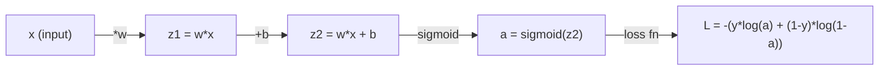
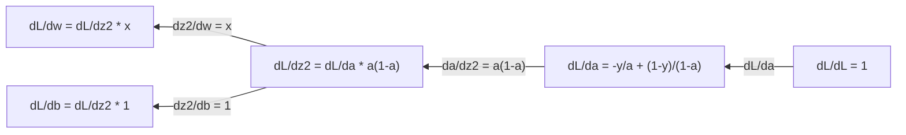
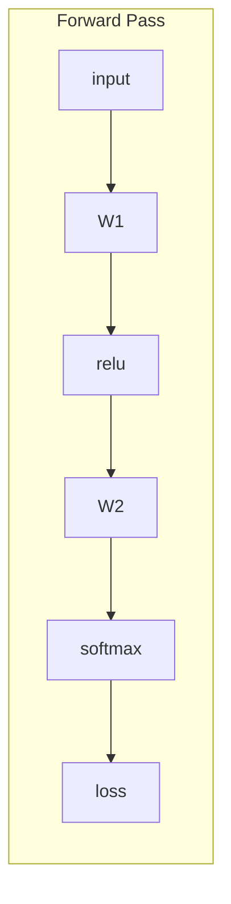
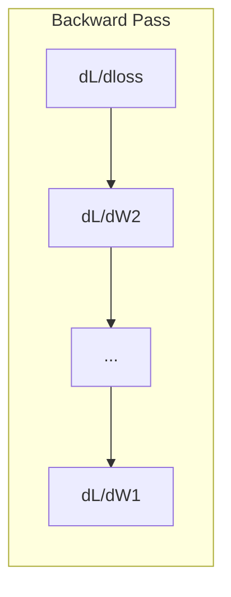

# 机器学习中的微积分

> Derivative 告诉你哪个方向是下坡。神经网络学习所需要的一切，仅此而已。

**类型：** 学习
**语言：** Python
**前置要求：** Phase 1, Lesson 01-03
**时间：** ~60 分钟

## 术语对照

- derivative，导数
- partial derivative，偏导数
- gradient，梯度
- gradient descent，梯度下降
- learning rate，学习率
- chain rule，链式法则
- Hessian，海森矩阵
- Jacobian，雅可比矩阵
- backpropagation，反向传播
- Taylor series，泰勒级数
- cross-entropy，交叉熵
- sigmoid，Sigmoid 函数
- MSE，均方误差
- Newton，牛顿法
- L-BFGS，L-BFGS
- Adam，Adam 优化器
- KL divergence，KL 散度
## 关键术语

| 术语 | 人们怎么说 | 实际含义 |
|------|-----------|---------|
| Derivative | "斜率" | 函数在某点的变化率。告诉你每单位输入变化对应多少输出变化。 |
| Partial derivative | "一个变量的 derivative" | 关于一个变量的 derivative，同时所有其他变量保持不变。 |
| Gradient | "最陡上升方向" | 所有 partial derivative 构成的 vector。指向函数上升最快的方向。 |
| Gradient descent | "向下走" | 从参数中减去 gradient（乘以 learning rate）以减少 loss。神经网络训练的核心。 |
| Learning rate | "步长" | 控制每个 gradient descent 步大小的标量。太大：发散。太小：收敛慢。 |
| Chain rule | "把 derivative 乘起来" | 求复合函数导数的规则：df/dx = df/dg · dg/dx。Backpropagation 的数学基础。 |
| Jacobian | "derivative matrix" | 当函数从 vector 映射到 vector 时，Jacobian 是所有输出关于所有输入的 partial derivative matrix。 |
| 数值 derivative | "有限差分" | 通过在两个邻近点求函数值并计算两者之间的斜率来近似 derivative。 |
| Backpropagation | "反向模式自动微分" | 使用 chain rule 从输出到输入逐层计算 gradient。神经网络学习的方式。 |
| Hessian | "二阶 derivative matrix" | 所有二阶 partial derivative 的 matrix。描述函数的曲率。临界点处 Hessian 正定意味着局部最小值。 |
| Taylor series | "多项式近似" | 使用 derivative 在一点附近近似函数：f(x+h) ≈ f(x) + f'(x)h + ½f''(x)h² + ... 理解为什么 gradient descent 和 Newton 法有效的理论基础。 |
| 积分 | "曲线下的面积" | 一个量在某个范围内的累积。在 ML 中，积分定义了概率、期望值和 KL divergence。 |

## 扩展阅读

- [3Blue1Brown：微积分的本质](https://www.3blue1brown.com/topics/calculus) —— derivative、积分和 chain rule 的视觉直觉
- [Stanford CS231n：Backpropagation](https://cs231n.github.io/optimization-2/) —— gradient 如何在神经网络层之间流动

## 学习目标

- 计算常见 ML 函数（x²、sigmoid、cross-entropy）的数值和解析 derivative
- 从零实现 gradient descent，在 1D 和 2D 中最小化一个 loss function
- 推导线性回归模型的 gradient，并通过手动 weight 更新进行训练
- 解释 Hessian matrix、Taylor series 近似及其与优化方法的关系

## 问题

你有一个包含数百万个 weight 的神经网络。每个 weight 是一个旋钮。你需要搞清楚该往哪个方向拧每一个旋钮，让模型错得少一点。微积分给你这个方向。

没有微积分，训练神经网络等于随机尝试各种改动然后祈祷。有了 derivative，你精确地知道每个 weight 如何影响误差。你每次都能把每个旋钮往正确的方向拧。

## 概念

### 什么是 derivative？

Derivative 衡量变化率。对于函数 y = f(x)，derivative f'(x) 告诉你：如果你把 x 微微拨动一点点，y 会变化多少？

几何上，derivative 是某点处的切线斜率。

**f(x) = x²：**

| x | f(x) | f'(x)（斜率） |
|---|------|--------------|
| 0 | 0    | 0（平坦，在底部） |
| 1 | 1    | 2 |
| 2 | 4    | 4（该点处的切线斜率） |
| 3 | 9    | 6 |

在 x=2 处，斜率是 4。如果你把 x 往右移一点点，y 增加大约该距离的 4 倍。在 x=0 处，斜率是 0。你处在碗底。

形式化定义：

```
f'(x) = lim   f(x + h) - f(x)
        h→0  -----------------
                     h
```

在代码中，你跳过极限，直接用一个很小的 h。这就是数值 derivative。

### Partial derivative：一次一个变量

真实的函数有很多输入。神经网络的 loss 依赖于成千上万个 weight。Partial derivative 保持除一个变量外的所有变量不变，然后对该变量求导。

```
f(x, y) = x² + 3xy + y²

∂f/∂x = 2x + 3y     （把 y 当常数）
∂f/∂y = 3x + 2y     （把 x 当常数）
```

每个 partial derivative 回答一个问题：如果我仅拨动这一个 weight，loss 如何变化？

### Gradient：所有 partial derivative 的 vector

Gradient 将所有 partial derivative 收集到一个 vector 中。对于函数 f(x, y, z)，gradient 是：

```
∇f = [ ∂f/∂x, ∂f/∂y, ∂f/∂z ]
```

Gradient 指向最陡上升的方向。要最小化一个函数，沿反方向走。

**f(x,y) = x² + y² 的等高线图：**

这个函数形成一个碗形，等高线是同心圆。最小值在 (0, 0)。

| 点 | ∇f | -∇f（下降方向） |
|------|-----|----------------|
| (1, 1) | [2, 2]（指向上坡，远离最小值） | [-2, -2]（指向下坡，趋近最小值） |
| (0, 0) | [0, 0]（平坦，在最小值处） | [0, 0] |

这就是 gradient descent 的图像。计算 gradient，取反，走一步。

### 与优化的关系

训练神经网络就是优化。你有一个 loss function L(w₁, w₂, ..., wₙ) 来衡量模型有多错。你想最小化它。

```
Gradient descent 更新规则：

  w_new = w_old - learning_rate * ∂L/∂w

对每个 weight：
  1. 计算 loss 关于该 weight 的 partial derivative
  2. 从 weight 中减去该 derivative 乘以一个小系数
  3. 重复
```

Learning rate 控制步长。太大则越过目标。太小则缓慢爬行。

**Loss 曲面（1D 切片）：**

loss function L(w) 随着 weight w 变化形成一条有峰有谷的曲线。

| 特征 | 描述 |
|------|------|
| 全局最小值 | 整条曲线上最低的点——最优解 |
| 局部最小值 | 比邻居低但不是全局最低的谷 |
| 斜率 | Gradient descent 从任意起点沿斜率下坡 |

Gradient descent 沿斜率下山。它可能陷入局部最小值，但在高维空间（数百万个 weight）中这在实践中很少成为问题。

### 数值 vs 解析 derivative

计算 derivative 有两种方式。

解析：手算微积分规则。对于 f(x) = x²，derivative 是 f'(x) = 2x。精确，快速。

数值：使用定义近似计算。对微小的 h 计算 f(x+h) 和 f(x-h)，然后取差分。

```
数值（中心差分）：

f'(x) ≈ f(x + h) - f(x - h)
        -----------------------
                2h

在实践中 h = 0.0001 效果很好
```

数值 derivative 较慢但适用于任何函数。解析 derivative 快速但需要你推导公式。神经网络框架使用第三种方法：自动微分，它机械化地计算精确 derivative。你将在 Phase 3 中看到。

### 常见函数的手算 derivative

以下是你在 ML 中反复见到的 derivative。

```
函数              Derivative       使用场景
--------          ----------       -------
f(x) = x²         f'(x) = 2x      Loss function（MSE）
f(x) = wx + b     f'(w) = x        Linear layer（关于 weight 的 gradient）
                  f'(b) = 1        Linear layer（关于 bias 的 gradient）
                  f'(x) = w        Linear layer（关于输入 x 的 gradient）
f(x) = eˣ         f'(x) = eˣ      Softmax、attention
f(x) = ln(x)      f'(x) = 1/x     Cross-entropy loss
f(x) = 1/(1+e⁻ˣ)  f'(x)=f(x)(1-f(x))  Sigmoid activation
```

对于 f(x) = x²：

```
f(x) = x²    f'(x) = 2x

  x    f(x)   f'(x)   含义
  -2    4      -4     斜率向左倾斜（递减）
  -1    1      -2     斜率向左倾斜（递减）
   0    0       0     平坦（最小值！）
   1    1       2     斜率向右倾斜（递增）
   2    4       4     斜率向右倾斜（递增）
```

对于 f(w) = wx + b，其中 x=3, b=1：

```
f(w) = 3w + 1    f'(w) = 3

关于 w 的 derivative 就是 x。
如果 x 大，w 的小改动就引起 output 的大变化。
```

### Chain rule

当函数复合时，chain rule 告诉你如何求导。

```
如果 y = f(g(x))，则 dy/dx = f'(g(x)) * g'(x)

例子：y = (3x + 1)²
  外层：f(u) = u²       f'(u) = 2u
  内层：g(x) = 3x + 1    g'(x) = 3
  dy/dx = 2(3x + 1) * 3 = 6(3x + 1)
```

神经网络就是函数的链条：input → linear → activation → linear → activation → loss。Backpropagation 就是从输出到输入重复应用 chain rule。这就是整个算法。

### Hessian Matrix

Gradient 告诉你斜率。Hessian 告诉你曲率。

Hessian 是二阶 partial derivative 的 matrix。对于函数 f(x₁, x₂, ..., xₙ)，Hessian 的项 (i, j) 为：

```
H[i][j] = ∂²f / (∂x_i · ∂x_j)
```

对于双变量函数 f(x, y)：

```
H = | ∂²f/∂x²    ∂²f/∂x∂y |
    | ∂²f/∂y∂x    ∂²f/∂y²  |
```

**Hessian 在临界点（gradient = 0 处）的意义：**

| Hessian 性质 | 含义 | 曲面示例 |
|-------------|------|---------|
| 正定（所有 eigenvalue > 0） | 局部最小值 | 朝上的碗 |
| 负定（所有 eigenvalue < 0） | 局部最大值 | 朝下的碗 |
| 不定（eigenvalue 混合正负） | 鞍点 | 马鞍形状 |

**例子：** f(x, y) = x² - y²（鞍函数）

```
∂f/∂x = 2x       ∂f/∂y = -2y
∂²f/∂x² = 2      ∂²f/∂y² = -2      ∂²f/∂x∂y = 0

H = | 2   0 |
    | 0  -2 |

Eigenvalue：2 和 -2（一正一负）
→ 鞍点在 (0, 0)
```

对比 f(x, y) = x² + y²（碗）：

```
H = | 2  0 |
    | 0  2 |

Eigenvalue：2 和 2（均为正）
→ 局部最小值在 (0, 0)
```

**Hessian 为何在 ML 中重要：**

Newton 法使用 Hessian 来采取比 gradient descent 更好的优化步长。它不仅跟随斜率，还考虑曲率：

```
Newton 更新：    w_new = w_old - H⁻¹ · gradient
Gradient descent： w_new = w_old - lr · gradient
```

Newton 法收敛更快，因为 Hessian 对 gradient 进行了"重新缩放"——陡的方向走小步，平的方向走大步。

但问题在于：对于有 N 个参数的神经网络，Hessian 是 N×N 的。一个 100 万参数的模型需要 1 万亿项的 matrix。这就是为什么我们使用近似方法。

| 方法 | 使用什么 | 每步成本 | 收敛速度 |
|------|---------|---------|---------|
| Gradient descent | 仅一阶 derivative | O(N)/步 | 慢（线性） |
| Newton 法 | 完整 Hessian | O(N³)/步 | 快（二次） |
| L-BFGS | 从 gradient 历史近似 Hessian | O(N)/步 | 中等（超线性） |
| Adam | 每参数自适应学习率（对角 Hessian 近似） | O(N)/步 | 中等 |
| Natural gradient | Fisher information matrix（统计 Hessian） | O(N²)/步 | 快 |

在实践中，Adam 是深度学习的默认 optimizer。它通过跟踪每参数 gradient 的运行均值和方差来廉价地近似二阶信息。

### Taylor Series 近似

任何光滑函数都可以局部用多项式近似：

```
f(x + h) = f(x) + f'(x)·h + (1/2)·f''(x)·h² + (1/6)·f'''(x)·h³ + ...
```

包含的项越多，近似越好——但仅在点 x 附近如此。

**Taylor series 为何对 ML 重要：**

- **一阶 Taylor = gradient descent。** 当你使用 f(x+h) ≈ f(x) + f'(x)·h 时，你在做线性近似。Gradient descent 最小化这个线性模型来选择 h = -lr · f'(x)。

- **二阶 Taylor = Newton 法。** 使用 f(x+h) ≈ f(x) + f'(x)·h + ½f''(x)·h²，你得到一个二次模型。最小化它得到 h = -f'(x)/f''(x)——正是 Newton 步长。

- **Loss function 设计。** MSE 和 cross-entropy 是光滑的，这意味着它们的 Taylor 展开表现良好。这不是偶然。光滑的 loss 使优化可预测。

```
近似阶数          捕捉什么            优化方法
---------         ----------          ----------
0 阶（常数）      仅函数值            随机搜索
1 阶（线性）      斜率                Gradient descent
2 阶（二次）      曲率                Newton 法
更高阶           更精细结构           ML 中极少使用
```

核心洞察：所有基于 gradient 的优化本质上都是局部近似 loss function，然后走向该近似的最小值。

### ML 中的积分

Derivative 告诉你变化率。积分计算累积量——曲线下的面积。

在 ML 中你很少手算积分，但这个概念无处不在：

**概率。** 对于有 density p(x) 的连续随机变量：
```
P(a < X < b) = ∫_a^b p(x) dx
```
概率 density 曲线下 a 到 b 之间的面积就是落在该范围内的概率。

**期望值。** 按概率加权的平均结果：
```
E[f(X)] = ∫ f(x) · p(x) dx
```
数据分布上的期望 loss 是一个积分。训练通过最小化其经验近似来完成。

**KL 散度。** 衡量两个分布有多不同：
```
KL(p || q) = ∫ p(x) · log(p(x) / q(x)) dx
```
用于 VAE、知识蒸馏和贝叶斯推断。

**归一化常数。** 在贝叶斯推断中：
```
p(w | data) = p(data | w) · p(w) / ∫ p(data | w) · p(w) dw
```
分母是对所有可能参数值的积分。它通常是不可计算的，所以我们要用 MCMC 和变分推断这样的近似方法。

| 积分概念 | 在 ML 中出现的地方 |
|---------|-----------------|
| 曲线下面积 | 从 density function 求概率 |
| 期望值 | Loss function、risk minimization |
| KL divergence | VAE、策略优化、蒸馏 |
| 归一化 | 贝叶斯后验、softmax 分母 |
| 边际 likelihood | 模型比较、evidence lower bound (ELBO) |

### 计算图中的多元 Chain Rule

Chain rule 不仅适用于排成一条线的标量函数。在神经网络中，变量分叉又汇合。以下是 derivative 如何通过一个简单 forward pass 流动：



Backward pass 从右到左计算 gradient：



每个箭头乘以局部的 derivative。任何参数的 gradient 是沿从 loss 到该参数路径上所有局部 derivative 的乘积。当路径分叉又汇合时，你把各路的贡献加起来（多元 chain rule）。

这就是 backpropagation 的全部：chain rule 通过计算图从输出到输入的系统性应用。

### Jacobian Matrix

当一个函数映射 vector 到 vector（如一个神经网络层），它的 derivative 是一个 matrix。Jacobian 包含每个输出关于每个输入的每个 partial derivative。

对于 f: Rⁿ → Rᵐ，Jacobian J 是 m×n matrix：

| | x₁ | x₂ | ... | xₙ |
|---|---|---|---|---|
| f₁ | ∂f₁/∂x₁ | ∂f₁/∂x₂ | ... | ∂f₁/∂xₙ |
| f₂ | ∂f₂/∂x₁ | ∂f₂/∂x₂ | ... | ∂f₂/∂xₙ |
| ... | ... | ... | ... | ... |
| fₘ | ∂fₘ/∂x₁ | ∂fₘ/∂x₂ | ... | ∂fₘ/∂xₙ |

你不会为神经网络手算 Jacobian。PyTorch 替你处理。但知道它的存在有助于你理解 backpropagation 中的 shape：如果一个层映射 Rⁿ 到 Rᵐ，它的 Jacobian 是 m×n。Gradient 通过该 matrix 的 transpose 反向流动。

### 这对神经网络为什么重要

神经网络中的每个 weight 得到一个 gradient。Gradient 告诉你如何调整该 weight 以减少 loss。





每个 weight 更新：
- `W1 = W1 - lr * dL/dW1`
- `W2 = W2 - lr * dL/dW2`

Forward pass 计算预测和 loss。Backward pass 计算 loss 关于每个 weight 的 gradient。然后每个 weight 沿下坡走一小步。重复数百万步。这就是深度学习。

## 动手实现

### 第 1 步：从零实现数值 derivative

```python
def numerical_derivative(f, x, h=1e-7):
    return (f(x + h) - f(x - h)) / (2 * h)

def f(x):
    return x ** 2

for x in [-2, -1, 0, 1, 2]:
    numerical = numerical_derivative(f, x)
    analytical = 2 * x
    print(f"x={x:2d}  f'(x) 数值={numerical:.6f}  解析={analytical:.1f}")
```

数值 derivative 与解析结果在小数点后多位完全匹配。

### 第 2 步：Partial derivative 和 gradient

```python
def numerical_gradient(f, point, h=1e-7):
    gradient = []
    for i in range(len(point)):
        point_plus = list(point)
        point_minus = list(point)
        point_plus[i] += h
        point_minus[i] -= h
        partial = (f(point_plus) - f(point_minus)) / (2 * h)
        gradient.append(partial)
    return gradient

def f_multi(point):
    x, y = point
    return x**2 + 3*x*y + y**2

grad = numerical_gradient(f_multi, [1.0, 2.0])
print(f"数值 gradient 在 (1,2)：{[f'{g:.4f}' for g in grad]}")
print(f"解析 gradient 在 (1,2)：[2*1+3*2, 3*1+2*2] = [{2*1+3*2}, {3*1+2*2}]")
```

### 第 3 步：Gradient descent 找 f(x) = x² 的最小值

```python
x = 5.0
lr = 0.1
for step in range(20):
    grad = 2 * x
    x = x - lr * grad
    print(f"步 {step:2d}  x={x:8.4f}  f(x)={x**2:10.6f}")
```

从 x=5 开始，每一步都更接近 x=0（最小值）。

### 第 4 步：在 2D 函数上做 gradient descent

```python
def f_2d(point):
    x, y = point
    return x**2 + y**2

point = [4.0, 3.0]
lr = 0.1
for step in range(30):
    grad = numerical_gradient(f_2d, point)
    point = [p - lr * g for p, g in zip(point, grad)]
    loss = f_2d(point)
    if step % 5 == 0 or step == 29:
        print(f"步 {step:2d}  point=({point[0]:7.4f}, {point[1]:7.4f})  f={loss:.6f}")
```

### 第 5 步：比较数值和解析 derivative

```python
import math

test_functions = [
    ("x^2",      lambda x: x**2,          lambda x: 2*x),
    ("x^3",      lambda x: x**3,          lambda x: 3*x**2),
    ("sin(x)",   lambda x: math.sin(x),   lambda x: math.cos(x)),
    ("e^x",      lambda x: math.exp(x),   lambda x: math.exp(x)),
    ("1/x",      lambda x: 1/x,           lambda x: -1/x**2),
]

x = 2.0
print(f"{'Function':<12} {'数值':>12} {'解析':>12} {'误差':>12}")
print("-" * 50)
for name, f, df in test_functions:
    num = numerical_derivative(f, x)
    ana = df(x)
    err = abs(num - ana)
    print(f"{name:<12} {num:12.6f} {ana:12.6f} {err:12.2e}")
```

### 第 6 步：数值计算 Hessian

```python
def hessian_2d(f, x, y, h=1e-5):
    fxx = (f(x + h, y) - 2 * f(x, y) + f(x - h, y)) / (h ** 2)
    fyy = (f(x, y + h) - 2 * f(x, y) + f(x, y - h)) / (h ** 2)
    fxy = (f(x + h, y + h) - f(x + h, y - h) - f(x - h, y + h) + f(x - h, y - h)) / (4 * h ** 2)
    return [[fxx, fxy], [fxy, fyy]]

def saddle(x, y):
    return x ** 2 - y ** 2

def bowl(x, y):
    return x ** 2 + y ** 2

H_saddle = hessian_2d(saddle, 0.0, 0.0)
H_bowl = hessian_2d(bowl, 0.0, 0.0)
print(f"鞍点 Hessian: {H_saddle}")   # [[2, 0], [0, -2]] —— 混合符号
print(f"碗 Hessian:   {H_bowl}")     # [[2, 0], [0, 2]]  —— 均为正
```

鞍函数的 Hessian 有 eigenvalue 2 和 -2（混合符号，确认了鞍点）。碗函数有 eigenvalue 2 和 2（均为正，确认了最小值）。

### 第 7 步：Taylor 近似的实际应用

```python
import math

def taylor_approx(f, f_prime, f_double_prime, x0, h, order=2):
    result = f(x0)
    if order >= 1:
        result += f_prime(x0) * h
    if order >= 2:
        result += 0.5 * f_double_prime(x0) * h ** 2
    return result

x0 = 0.0
for h in [0.1, 0.5, 1.0, 2.0]:
    true_val = math.sin(h)
    t1 = taylor_approx(math.sin, math.cos, lambda x: -math.sin(x), x0, h, order=1)
    t2 = taylor_approx(math.sin, math.cos, lambda x: -math.sin(x), x0, h, order=2)
    print(f"h={h:.1f}  sin(h)={true_val:.4f}  一阶={t1:.4f}  二阶={t2:.4f}")
```

在 x₀=0 附近，sin(x) ≈ x（一阶 Taylor）。近似对小的 h 极其准确，但对大的 h 失效。这就是为什么 gradient descent 用小的 learning rate 效果最好——每一步都假设线性近似是准确的。

### 第 8 步：这对神经网络意味着什么

```python
import random

random.seed(42)

w = random.gauss(0, 1)
b = random.gauss(0, 1)
lr = 0.01

xs = [1.0, 2.0, 3.0, 4.0, 5.0]
ys = [3.0, 5.0, 7.0, 9.0, 11.0]

for epoch in range(200):
    total_loss = 0
    dw = 0
    db = 0
    for x, y in zip(xs, ys):
        pred = w * x + b
        error = pred - y
        total_loss += error ** 2
        dw += 2 * error * x
        db += 2 * error
    dw /= len(xs)
    db /= len(xs)
    total_loss /= len(xs)
    w -= lr * dw
    b -= lr * db
    if epoch % 40 == 0 or epoch == 199:
        print(f"epoch {epoch:3d}  w={w:.4f}  b={b:.4f}  loss={total_loss:.6f}")

print(f"\n学到的：y = {w:.2f}x + {b:.2f}")
print(f"实际的：y = 2x + 1")
```

每个基于 gradient 的训练循环都遵循这个模式：预测，计算 loss，计算 gradient，更新 weight。

## 实际使用

用 NumPy，同样的操作更快更简洁：

```python
import numpy as np

x = np.array([1, 2, 3, 4, 5], dtype=float)
y = np.array([3, 5, 7, 9, 11], dtype=float)

w, b = np.random.randn(), np.random.randn()
lr = 0.01

for epoch in range(200):
    pred = w * x + b
    error = pred - y
    loss = np.mean(error ** 2)
    dw = np.mean(2 * error * x)
    db = np.mean(2 * error)
    w -= lr * dw
    b -= lr * db

print(f"学到的：y = {w:.2f}x + {b:.2f}")
```

你刚刚从零实现了 gradient descent。PyTorch 自动完成 gradient 计算，但更新循环完全相同。

## 练习

1. 实现 `numerical_second_derivative(f, x)`，通过调用两次 `numerical_derivative`。验证 x³ 在 x=2 处的二阶 derivative 是 12。
2. 使用 gradient descent 找 f(x, y) = (x-3)² + (y+1)² 的最小值。从 (0, 0) 出发。答案应收敛到 (3, -1)。
3. 给 gradient descent 循环添加 momentum：维护一个累积过去 gradient 的速度 vector。在 f(x) = x⁴ - 3x² 上比较有和没有 momentum 的收敛速度。
