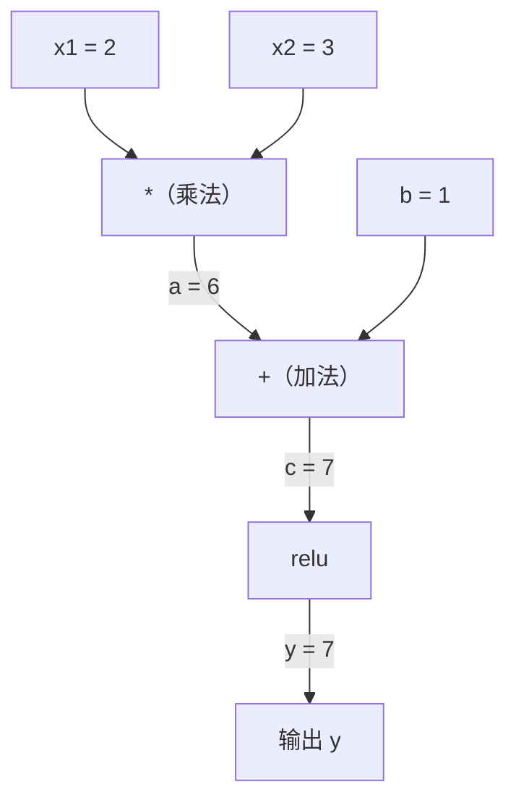
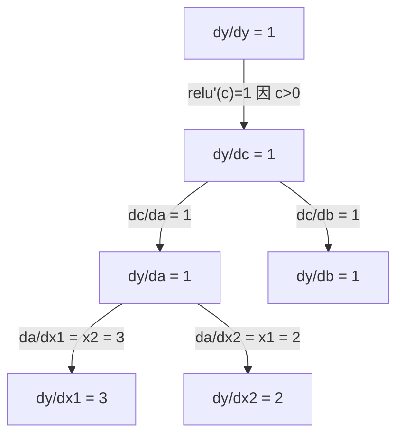

# Chain Rule 与自动微分

> Chain rule 是每一个会学习的神经网络背后的引擎。

**类型：** 动手实现
**语言：** Python
**前置要求：** Phase 1, Lesson 04（Derivative 与 Gradient）
**时间：** ~90 分钟

## 术语对照

- chain rule，链式法则
- autograd，自动微分
- forward mode，前向模式
- reverse mode，反向模式
- dual number，对偶数
- topological sort，拓扑排序
- MLP，多层感知机
- neuron，神经元
- gradient checking，梯度检查
- compute graph，计算图
## 关键术语

| 术语 | 人们怎么说 | 实际含义 |
|------|-----------|---------|
| Chain rule | "把 derivative 乘起来" | 复合函数的 derivative 等于每个函数局部 derivative 在正确点求值后的乘积 |
| 计算图 | "网络图" | 一个有向无环图，节点是操作，边承载值（forward）或 gradient（backward） |
| Forward mode | "向前推 derivative" | 从输入到输出传播 derivative 的 autodiff。每输入变量一次 pass。 |
| Reverse mode | "Backpropagation" | 从输出到输入传播 gradient 的 autodiff。每输出变量一次 pass。 |
| Autograd | "自动 gradient" | 一个记录对值的操作、构建图、通过 chain rule 计算精确 gradient 的系统 |
| Dual number | "值加 derivative" | 形式为 a + b·ε（ε²=0）的数，在算术运算中携带 derivative 信息 |
| 拓扑排序 | "依赖顺序" | 将图节点排序，使每个节点在其所有依赖之后。对正确的 gradient 传播是必需的。 |
| Gradient accumulation | "加，不替换" | 当一个值流入多个操作时，其 gradient 是所有流入的 gradient 贡献之和 |
| 动态图 | "Define by run" | 每次 forward pass 重建计算图，允许模型内部使用 Python 控制流（PyTorch 风格） |
| Gradient checking | "数值验证" | 将 autodiff gradient 与数值有限差分 gradient 对比以验证正确性。调试必不可少的工具。 |
| MLP | "多层感知器" | 具有一个或多个隐藏 neuron 层的神经网络。每个 neuron 计算加权和加 bias，然后应用 activation function。 |
| Neuron | "加权和 + activation" | 基本单元：output = activation(w1·x1 + w2·x2 + ... + b)。Weight 和 bias 是可学习的参数。 |

## 扩展阅读

- [3Blue1Brown：Backpropagation 微积分](https://www.youtube.com/watch?v=tIeHLnjs5U8) —— 神经网络中 chain rule 的视觉解释
- [PyTorch Autograd 机制](https://pytorch.org/docs/stable/notes/autograd.html) —— 真实系统如何工作
- [Baydin et al., Automatic Differentiation in Machine Learning: a Survey](https://arxiv.org/abs/1502.05767) —— 综合参考

## 学习目标

- 构建一个最小 autograd 引擎（Value 类），记录操作并通过反向模式自动微分计算 gradient
- 使用拓扑排序在计算图中实现 forward 和 backward pass
- 仅使用从零构建的 autograd 引擎构建并训练一个 XOR 上的多层感知器
- 通过与数值有限差分的 gradient checking 验证 autodiff 正确性

## 问题

你可以计算简单函数的 derivative。但神经网络不是一个简单函数。它是数百个函数的复合：矩阵乘法、加 bias、应用 activation、再次矩阵乘法、softmax、cross-entropy loss。输出是函数的函数的函数。

要训练网络，你需要 loss 关于每一个 weight 的 gradient。对数百万参数手算这是不可能的。用数值方法（有限差分）又太慢。

Chain rule 给出数学。自动微分给出算法。两者结合让你能够以与单次 forward pass 成比例的时间，计算任意函数复合的精确 gradient。

这就是 PyTorch、TensorFlow 和 JAX 的运作方式。你将从零构建一个微型版本。

## 概念

### Chain Rule

如果 `y = f(g(x))`，y 关于 x 的 derivative 是：

```
dy/dx = dy/dg · dg/dx = f'(g(x)) · g'(x)
```

沿着链将 derivative 相乘。每个环节贡献它的局部 derivative。

例子：`y = sin(x²)`

```
g(x) = x²       g'(x) = 2x
f(g) = sin(g)   f'(g) = cos(g)

dy/dx = cos(x²) · 2x
```

对更深的复合，链被延伸：

```
y = f(g(h(x)))

dy/dx = f'(g(h(x))) · g'(h(x)) · h'(x)
```

神经网络中的每一层都是这条链上的一个环节。

### 计算图

计算图把 chain rule 可视化。每个操作成为一个节点。数据在图上前向流动。Gradient 反向流动。

**Forward pass（计算值）：**



**Backward pass（计算 gradient）：**



Backward pass 在每个节点应用 chain rule，将 gradient 从输出传播到输入。

### Forward Mode vs Reverse Mode

有两种方式在图上应用 chain rule。

**Forward mode** 从输入开始，将 derivative 向前推。它计算 `dx/dx = 1` 并逐操作传播。适用于输入少、输出多的情况。

```
Forward mode：种子 dx/dx = 1，向前传播

  x = 2       (dx/dx = 1)
  a = x²      (da/dx = 2x = 4)
  y = sin(a)  (dy/dx = cos(a) · da/dx = cos(4) · 4 = -2.615)
```

**Reverse mode** 从输出开始，将 gradient 向后拉。它计算 `dy/dy = 1` 并反向逐操作传播。适用于输入多、输出少的情况。

```
Reverse mode：种子 dy/dy = 1，向后传播

  y = sin(a)  (dy/dy = 1)
  a = x²      (dy/da = cos(a) = cos(4) = -0.654)
  x = 2       (dy/dx = dy/da · da/dx = -0.654 · 4 = -2.615)
```

神经网络有数百万输入（weight）和一个输出（loss）。Reverse mode 只需一次 backward pass 即可计算所有 gradient。这就是 backpropagation 使用 reverse mode 的原因。

| 模式 | 种子 | 方向 | 最适合 |
|------|------|------|--------|
| Forward | `dx_i/dx_i = 1` | 输入到输出 | 输入少，输出多 |
| Reverse | `dy/dy = 1` | 输出到输入 | 输入多，输出少（神经网络） |

### 用于 Forward Mode 的对偶数

Forward mode 可以用对偶数优雅地实现。一个 dual number 形式为 `a + b·ε`，其中 `ε² = 0`。

```
Dual number：(值, derivative)

(2, 1) 表示：值为 2，关于 x 的 derivative 为 1

算术规则：
  (a, a') + (b, b') = (a+b, a'+b')
  (a, a') * (b, b') = (a·b, a'·b + a·b')
  sin(a, a')         = (sin(a), cos(a)·a')
```

给输入变量种一个 derivative=1 的种子。Derivative 自动通过每一个运算传播。

### 构建一个 Autograd 引擎

一个 autograd 引擎需要三样东西：

1. **Value 包装。** 将每个数字包装在一个对象中，对象存储其值和 gradient。
2. **图记录。** 每个操作记录其输入和局部 gradient 函数。
3. **Backward pass。** 对图进行拓扑排序，然后反向遍历，在每个节点应用 chain rule。

这正是 PyTorch 的 `autograd` 所做的一切。`torch.Tensor` 类包装值，当 `requires_grad=True` 时记录操作，并在你调用 `.backward()` 时计算 gradient。

### PyTorch Autograd 底层如何工作

当你写 PyTorch 代码：

```python
x = torch.tensor(2.0, requires_grad=True)
y = x ** 2 + 3 * x + 1
y.backward()
print(x.grad)  # 7.0 = 2*x + 3 = 2*2 + 3
```

PyTorch 内部做了：

1. 为 `x` 创建一个 `Tensor` 节点，设置 `requires_grad=True`
2. 每个操作（`**`，`*`，`+`）创建一个新节点并记录 backward function
3. `y.backward()` 通过记录好的图触发 reverse-mode autodiff
4. 每个节点的 `grad_fn` 计算局部 gradient 并将其传递给父节点
5. Gradient 通过加法（而非替换）累积到 `.grad` 属性中

图是动态的（define-by-run）。每次 forward pass 都构建一个新图。这就是 PyTorch 支持模型内部的控制流（if/else、循环）的原因。

## 动手实现

### 第 1 步：Value 类

```python
class Value:
    def __init__(self, data, children=(), op=''):
        self.data = data
        self.grad = 0.0
        self._backward = lambda: None
        self._prev = set(children)
        self._op = op

    def __repr__(self):
        return f"Value(data={self.data:.4f}, grad={self.grad:.4f})"
```

每个 `Value` 存储其数值数据、gradient（初始为零）、一个 backward function 和指向产生它的子节点的指针。

### 第 2 步：带 gradient 追踪的算术运算

```python
    def __add__(self, other):
        other = other if isinstance(other, Value) else Value(other)
        out = Value(self.data + other.data, (self, other), '+')
        def _backward():
            self.grad += out.grad
            other.grad += out.grad
        out._backward = _backward
        return out

    def __mul__(self, other):
        other = other if isinstance(other, Value) else Value(other)
        out = Value(self.data * other.data, (self, other), '*')
        def _backward():
            self.grad += other.data * out.grad
            other.grad += self.data * out.grad
        out._backward = _backward
        return out

    def relu(self):
        out = Value(max(0, self.data), (self,), 'relu')
        def _backward():
            self.grad += (1.0 if out.data > 0 else 0.0) * out.grad
        out._backward = _backward
        return out
```

每个操作创建一个闭包，知道如何计算局部 gradient 并乘以上游 gradient（`out.grad`）。`+=` 处理一个值在多个操作中使用的情况。

### 第 3 步：Backward pass

```python
    def backward(self):
        topo = []
        visited = set()
        def build_topo(v):
            if v not in visited:
                visited.add(v)
                for child in v._prev:
                    build_topo(child)
                topo.append(v)
        build_topo(self)

        self.grad = 1.0
        for v in reversed(topo):
            v._backward()
```

拓扑排序确保每个节点的 gradient 在传播到其子节点之前已完全计算好。种子 gradient 为 1.0（dy/dy = 1）。

### 第 4 步：完善引擎的更多操作

基本 Value 类处理加法、乘法和 relu。真正的 autograd 引擎需要更多。以下是构建神经网络所需的操作：

```python
    def __neg__(self):
        return self * -1

    def __sub__(self, other):
        return self + (-other)

    def __radd__(self, other):
        return self + other

    def __rmul__(self, other):
        return self * other

    def __rsub__(self, other):
        return other + (-self)

    def __pow__(self, n):
        out = Value(self.data ** n, (self,), f'**{n}')
        def _backward():
            self.grad += n * (self.data ** (n - 1)) * out.grad
        out._backward = _backward
        return out

    def __truediv__(self, other):
        return self * (other ** -1) if isinstance(other, Value) else self * (Value(other) ** -1)

    def exp(self):
        import math
        e = math.exp(self.data)
        out = Value(e, (self,), 'exp')
        def _backward():
            self.grad += e * out.grad
        out._backward = _backward
        return out

    def log(self):
        import math
        out = Value(math.log(self.data), (self,), 'log')
        def _backward():
            self.grad += (1.0 / self.data) * out.grad
        out._backward = _backward
        return out

    def tanh(self):
        import math
        t = math.tanh(self.data)
        out = Value(t, (self,), 'tanh')
        def _backward():
            self.grad += (1 - t ** 2) * out.grad
        out._backward = _backward
        return out
```

**为什么每个操作都重要：**

| 操作 | Backward 规则 | 使用场景 |
|------|-------------|---------|
| `__sub__` | 复用 add + neg | Loss 计算 (pred - target) |
| `__pow__` | n · x^(n-1) | 多项式 activation、MSE (error²) |
| `__truediv__` | 复用 mul + pow(-1) | 归一化、learning rate 缩放 |
| `exp` | exp(x) · upstream | Softmax、log-likelihood |
| `log` | (1/x) · upstream | Cross-entropy loss、log probability |
| `tanh` | (1 - tanh²) · upstream | 经典 activation function |

巧妙之处：`__sub__` 和 `__truediv__` 用已有的操作定义。它们免费获得了正确的 gradient，因为 chain rule 通过底层的 add/mul/pow 操作复合。

### 第 5 步：从零构建 Mini MLP

有了完整的 Value 类，你就可以构建神经网络。不用 PyTorch。不用 NumPy。只有 Value 和 chain rule。

```python
import random

class Neuron:
    def __init__(self, n_inputs):
        self.w = [Value(random.uniform(-1, 1)) for _ in range(n_inputs)]
        self.b = Value(0.0)

    def __call__(self, x):
        act = sum((wi * xi for wi, xi in zip(self.w, x)), self.b)
        return act.tanh()

    def parameters(self):
        return self.w + [self.b]

class Layer:
    def __init__(self, n_inputs, n_outputs):
        self.neurons = [Neuron(n_inputs) for _ in range(n_outputs)]

    def __call__(self, x):
        return [n(x) for n in self.neurons]

    def parameters(self):
        return [p for n in self.neurons for p in n.parameters()]

class MLP:
    def __init__(self, sizes):
        self.layers = [Layer(sizes[i], sizes[i+1]) for i in range(len(sizes)-1)]

    def __call__(self, x):
        for layer in self.layers:
            x = layer(x)
        return x[0] if len(x) == 1 else x

    def parameters(self):
        return [p for layer in self.layers for p in layer.parameters()]
```

一个 `Neuron` 计算 `tanh(w1·x1 + w2·x2 + ... + b)`。一个 `Layer` 是 neuron 的列表。一个 `MLP` 堆叠各层。每个 weight 都是一个 `Value`，所以调用 `loss.backward()` 会将 gradient 传播到每个参数。

**在 XOR 上训练：**

```python
random.seed(42)
model = MLP([2, 4, 1])  # 2 输入，4 隐藏 neuron，1 输出

xs = [[0, 0], [0, 1], [1, 0], [1, 1]]
ys = [-1, 1, 1, -1]  # XOR 模式（对 tanh 用 -1/1）

for step in range(100):
    preds = [model(x) for x in xs]
    loss = sum((p - y) ** 2 for p, y in zip(preds, ys))

    for p in model.parameters():
        p.grad = 0.0
    loss.backward()

    lr = 0.05
    for p in model.parameters():
        p.data -= lr * p.grad

    if step % 20 == 0:
        print(f"步 {step:3d}  loss = {loss.data:.4f}")

print("\n训练后的预测：")
for x, y in zip(xs, ys):
    print(f"  输入={x}  目标={y:2d}  预测={model(x).data:6.3f}")
```

这就是 micrograd。纯 Python 的完整神经网络训练循环，带自动微分。每个商用的深度学习框架在大规模上做着同样的事。

### 第 6 步：Gradient Checking

你怎么知道 autodiff 是正确的？与数值 derivative 对比。这就是 gradient checking。

```python
def gradient_check(build_expr, x_val, h=1e-7):
    x = Value(x_val)
    y = build_expr(x)
    y.backward()
    autodiff_grad = x.grad

    y_plus = build_expr(Value(x_val + h)).data
    y_minus = build_expr(Value(x_val - h)).data
    numerical_grad = (y_plus - y_minus) / (2 * h)

    diff = abs(autodiff_grad - numerical_grad)
    return autodiff_grad, numerical_grad, diff
```

在复杂表达式上测试：

```python
def expr(x):
    return (x ** 3 + x * 2 + 1).tanh()

ad, num, diff = gradient_check(expr, 0.5)
print(f"Autodiff:  {ad:.8f}")
print(f"数值:      {num:.8f}")
print(f"差异:      {diff:.2e}")
# 差异应 < 1e-5
```

Gradient checking 在实现新操作时至关重要。如果你的 backward pass 有 bug，数值检测会捕获它。每个严肃的深度学习实现在开发期间都运行 gradient check。

**何时使用 gradient checking：**

| 情况 | 做 gradient check？ |
|------|--------------------|
| 给 autograd 添加新操作 | 是的，永远做 |
| 调试一个不收敛的训练循环 | 是的，先检查 gradient |
| 生产训练 | 不做，太慢（每参数 2 次 forward pass） |
| Autograd 代码的单元测试 | 是的，自动化 |

### 第 7 步：与手算对比验证

```python
x1 = Value(2.0)
x2 = Value(3.0)
a = x1 * x2          # a = 6.0
b = a + Value(1.0)   # b = 7.0
y = b.relu()         # y = 7.0

y.backward()

print(f"y = {y.data}")         # 7.0
print(f"dy/dx1 = {x1.grad}")   # 3.0 (= x2)
print(f"dy/dx2 = {x2.grad}")   # 2.0 (= x1)
```

手算验证：`y = relu(x1·x2 + 1)`。由于 `x1·x2 + 1 = 7 > 0`，relu 是恒等的。
`dy/dx1 = x2 = 3`。`dy/dx2 = x1 = 2`。引擎匹配。

## 实际使用

### 与 PyTorch 对比验证

```python
import torch

x1 = torch.tensor(2.0, requires_grad=True)
x2 = torch.tensor(3.0, requires_grad=True)
a = x1 * x2
b = a + 1.0
y = torch.relu(b)
y.backward()

print(f"PyTorch dy/dx1 = {x1.grad.item()}")  # 3.0
print(f"PyTorch dy/dx2 = {x2.grad.item()}")  # 2.0
```

相同的 gradient。你的引擎算出了与 PyTorch 相同的结果，因为数学是一样的：通过 chain rule 的 reverse-mode autodiff。

### 更复杂的表达式

```python
a = Value(2.0)
b = Value(-3.0)
c = Value(10.0)
f = (a * b + c).relu()  # relu(2*(-3) + 10) = relu(4) = 4

f.backward()
print(f"df/da = {a.grad}")  # -3.0 (= b)
print(f"df/db = {b.grad}")  #  2.0 (= a)
print(f"df/dc = {c.grad}")  #  1.0
```

## 产出

本节课产出：
- `outputs/skill-autodiff.md`——构建和调试 autograd 系统的 skill
- `code/autodiff.py`——一个你可以扩展的最小 autograd 引擎

此处构建的 Value 类是 Phase 3 中神经网络训练循环的基础。

## 练习

1. 给 Value 类添加 `__pow__` 以支持 `x ** n`。验证在 `x=2` 处 `d/dx(x³) = 12.0`。

2. 添加 `tanh` 作为 activation function。验证 `tanh'(0) = 1` 和 `tanh'(2) ≈ 0.0707`。

3. 为单个 neuron 构建计算图：`y = relu(w1·x1 + w2·x2 + b)`。计算所有五个 gradient 并与 PyTorch 对比。

4. 使用 dual number 实现 forward-mode autodiff。创建一个 `Dual` 类并验证它给出与 reverse-mode 引擎相同的 derivative。
